# TP1 : Manipulation du système de fichiers HDFS

## Table des matières
- [Objectif](#objectif)
- [Solution](#solution)
- [API JAVA](#api-java)
- [Installation HADDOP](#installation-hadoop-sur-linux)


## Objectif 
Ce TP vise à familiariser les apprenants avec le système de fichiers distribué Hadoop (HDFS). Les objectifs spécifiques comprennent le démarrage des processus Hadoop, la création d'une structure d'arborescence dans le HDFS, la manipulation de fichiers en utilisant des commandes Hadoop, la copie de fichiers entre différents répertoires, la visualisation du contenu des fichiers, et la gestion des fichiers locaux et distants.


[Installation HADOOP Sur LINUX](#installation-hadoop-sur-linux)
<hr>

## Solution

**1. Démarrage des processus Hadoop**

Pour démarrer les processus Hadoop, nous utilisons les commandes suivantes :

```bash
start-dfs.sh
start-yarn.sh
```

Nous vérifions ensuite que les processus sont en cours d'exécution avec la commande `jps`. Nous accédons à l'interface web de NameNode en utilisant le lien http://localhost:50070.

**2. Création de l'arborescence dans le HDFS**


Nous créons la structure demandée dans la racine du HDFS avec les commandes Hadoop suivantes :

```bash
hdfs dfs -mkdir /BDDC
hdfs dfs -mkdir /BDDC/JAVA
hdfs dfs -mkdir /BDDC/JAVA/TPs
hdfs dfs -mkdir /BDDC/JAVA/Cours
hdfs dfs -mkdir /BDDC/CPP
hdfs dfs -mkdir /BDDC/CPP/TPs
hdfs dfs -mkdir /BDDC/CPP/Cours
```
`Commandes en raccourci pour créer l'arborescence demandée dans le HDFS :`
```bash
hdfs dfs -mkdir -p /BDDC/{JAVA,CPP}/{Cours,TPs}
```
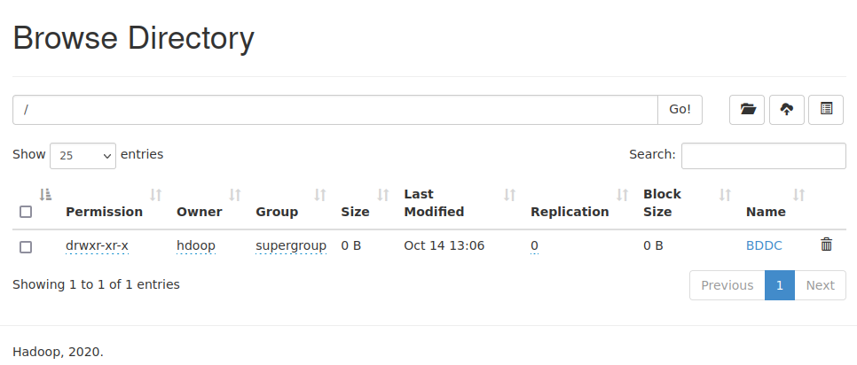


**3. Création et ajout de contenu dans les fichiers Cours de CPP**

```bash
echo "CoursCPP1" > CoursCPP1
echo "CoursCPP2" > CoursCPP2
echo "CoursCPP3" > CoursCPP3
hdfs dfs -put CoursCPP{1,2,3} /BDDC/CPP/Cours
```
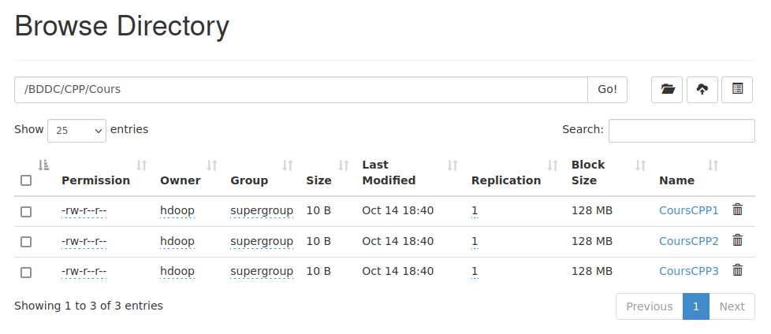

**4. Affichage du contenu des fichiers CoursCPP1, CoursCPP2 et CoursCPP3**

```bash
hdfs dfs -cat /BDDC/CPP/Cours/CoursCPP1
hdfs dfs -cat /BDDC/CPP/Cours/CoursCPP2
hdfs dfs -cat /BDDC/CPP/Cours/CoursCPP3
```
`Commandes en raccourci`
```bash
hdfs dfs -cat /BDDC/CPP/Cours/CoursCPP{1,2,3}
```
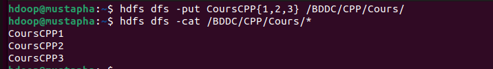

**5. Copie des fichiers CPP vers le répertoire JAVA**

```bash
hdfs dfs -cp /BDDC/CPP/Cours/CoursCPP{1,2,3} /BDDC/JAVA/Cours
```
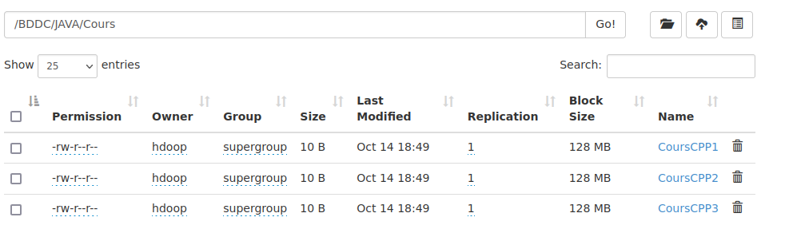
**6. Suppression et renommage des fichiers dans le répertoire JAVA**

```bash
hdfs dfs -rm /BDDC/JAVA/Cours/CoursCPP3
hdfs dfs -mv /BDDC/JAVA/Cours/CoursCPP1 /BDDC/JAVA/Cours/CoursJAVA1
hdfs dfs -mv /BDDC/JAVA/Cours/CoursCPP2 /BDDC/JAVA/Cours/CoursJAVA2
```
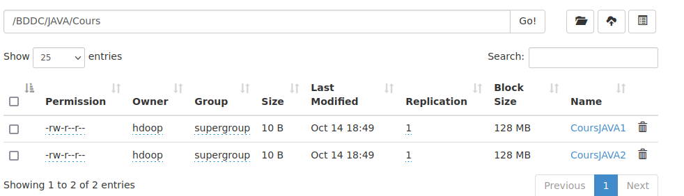
**7. Création de fichiers locaux**

```bash
touch TP1CPP TP2CPP TP1JAVA TP2JAVA TP3JAVA
```
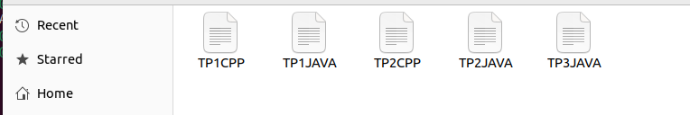

**8 et 9. Copie des fichiers locaux vers le HDFS**

```bash
hdfs dfs -copyFromLocal TP{1,2}CPP /BDDC/CPP/TPs
hdfs dfs -copyFromLocal TP{1,2,3}JAVA /BDDC/JAVA/TPs
```

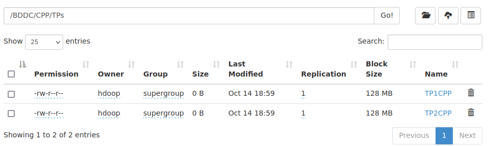
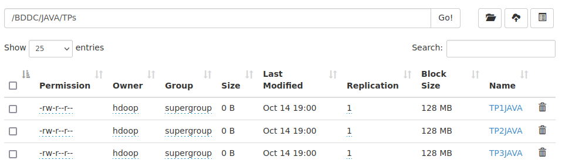

**10. Affichage récursif du contenu de BDDC**

```bash
hdfs dfs -ls -R /BDDC
```
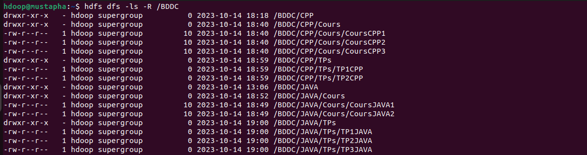

**11. Suppression du fichier TP1CPP**

```bash
hdfs dfs -rm /BDDC/CPP/TPs/TP1CPP
```
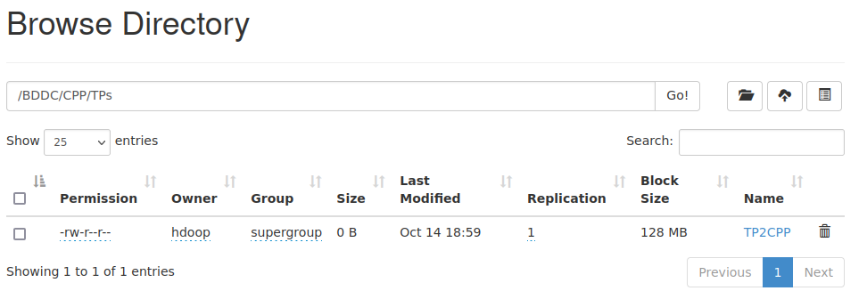

**12. Suppression du répertoire JAVA et de son contenu**

```bash
hdfs dfs -rm -r /BDDC/JAVA
```
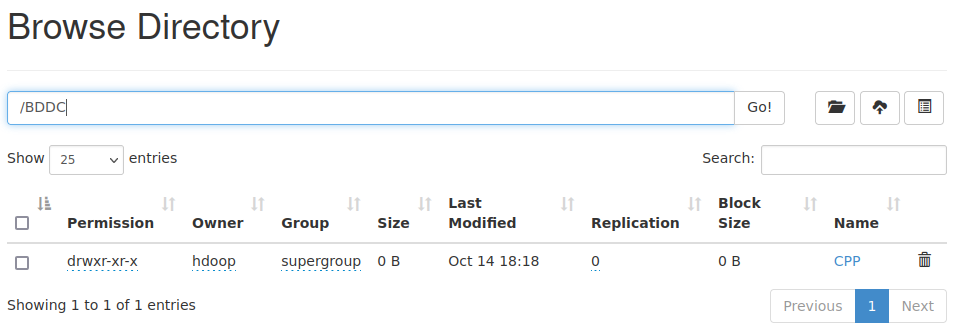

## API JAVA
Pour accéder au code source de l'API et explorer le dépôt GitHub associé, veuillez visiter [github.com/Slimani-CE/hadoop-crud-api](https://github.com/Slimani-CE/hadoop-crud-api) 
## Installation HADOOP Sur LINUX

**1. Installation de Java 8 :**
   - Mise à jour des packages avec `sudo apt-get update`.
   - Installation de Java 8 avec `sudo apt-get install openjdk-8-jdk`.
   - Vérification de l'installation avec `java -version`.
   - Ajout de la variable JAVA_HOME dans /etc/environment.

```bash
# Étape 1 : Mise à jour des packages
sudo apt-get update

# Étape 2 : Installation de Java 8
sudo apt-get install openjdk-8-jdk

# Étape 3 : Vérification de l'installation de Java
java -version

# Étape 4 : Édition de /etc/environment pour ajouter JAVA_HOME
sudo nano /etc/environment
JAVA_HOME="/usr/lib/jvm/java-8-openjdk-amd64"
```

**2. Installation d'Open SSH Client et Open SSH Server :**

```bash
# Installation d'Open SSH Client et Server
sudo apt-get install openssh-server openssh-client
```

**3. Génération de paires de clés privées/publiques et Configuration SSH sans mot de passe :**

```bash
# Génération de paires de clés
ssh-keygen -t rsa -P ""

# Configuration SSH sans mot de passe
cat $HOME/.ssh/id_rsa.pub >> $HOME/.ssh/authorized_keys

# Vérification de la connexion SSH sur localhost
ssh localhost
```
`Resultats: Welcome to Ubuntu 22.04.3 LTS (GNU/Linux 6.2.0-26-generic x86_64)`

**4. Téléchargement et Installation de Hadoop 2.7.1 :**

```bash
# Téléchargement de Hadoop 2.7.1
wget https://archive.apache.org/dist/hadoop/common/hadoop-2.7.1/hadoop-2.7.1.tar.gz

# Extraction du dossier
tar xzf hadoop-2.7.1.tar.gz

# Édition de .bashrc pour ajouter les variables
nano ~/.bashrc
```

Dans ~/.bashrc, ajoutez les lignes suivantes à la fin du fichier :

```bash
export HADOOP_PREFIX=/[chemin]/hadoop-2.7.1
export PATH=$PATH:$HADOOP_PREFIX/bin
export PATH=$PATH:$HADOOP_PREFIX/sbin
export HADOOP_MAPRED_HOME=${HADOOP_PREFIX}
export HADOOP_COMMON_HOME=${HADOOP_PREFIX}
export HADOOP_HDFS_HOME=${HADOOP_PREFIX}
export YARN_HOME=${HADOOP_PREFIX}
export HADOOP_COMMON_LIB_NATIVE_DIR=$HADOOP_PREFIX/lib/native
export HADOOP_OPTS="-Djava.library.path=$HADOOP_PREFIX/lib/native"
```

**5. Configuration des fichiers de Hadoop :**
   - Modification de hadoop-env.sh, core-site.xml, hdfs-site.xml, mapred-site.xml, yarn-site.xml.

```bash
nano hadoop-2.7.1/etc/hadoop/hadoop-env.sh
```
```bash
JAVA_HOME="/usr/lib/jvm/java-8-openjdk-amd64"
```
```bash
nano hadoop-2.7.1/etc/hadoop/core-site.xml
```
```bash
<configuration>
  <property>
      <name>fs.defaultFS</name>
      <value>hdfs://localhost:9000</value>
  </property>
</configuration>
```
```bash
nano hadoop-2.7.1/etc/hadoop/hdfs-site.xml
```
```bash
<configuration>
  <property>
      <name>dfs.name.dir</name>
      <value>/{chemin}/hdata/dfs/name</value>
  </property>
  <property>
      <name>dfs.data.dir</name>
      <value>/{chemin} /hdata/dfs/data</value>
  </property>
  <property>
      <name>dfs.replication</name>
      <value>1</value>
  </property>
</configuration>
```
```bash
nano hadoop-2.7.1/etc/hadoop/mapred-site.xml.template
```
```bash
<configuration>
  <property>
      <name>mapreduce.framework.name</name>
      <value>yarn</value>
  </property>
</configuration>
```
```bash
nano hadoop-2.7.1/etc/hadoop/yarn-site.xml
```
```bash
<configuration>
  <property>
      <name>yarn.nodemanager.aux-services</name>
      <value>mapreduce_shuffle</value>
  </property>
  <property>
      <name>yarn.nodemanager.aux-services.mapreduce.shuffle.class</name>
      <value>org.apache.hadoop.mapred.ShuffleHandler</value>
  </property>
</configuration>
```

**6. Chargement des nouvelles configurations :**

```bash
# Chargement de .bashrc
source ~/.bashrc
```

**7. Démarrage du cluster :**

```bash
# Étape 1 : Formater le Name Node
hdfs namenode -format

# Étape 2 : Démarrer les services HDFS
start-dfs.sh

# Étape 3 : Démarrer les services YARN
start-yarn.sh

# Étape 4 : Vérification des services démarrés
jps
```
